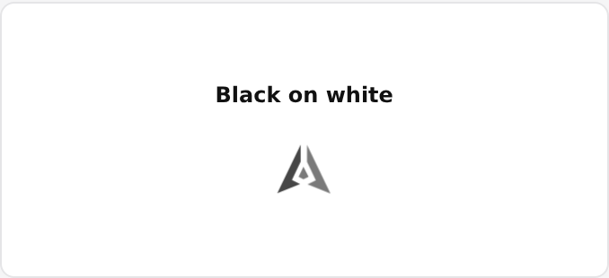

# GenLayer Spinner

Community-contributed animated spinner proposal for the GenLayer Portal mission **Design the GenLayer Spinner**.

Selected design: **Three Perspectives, One Decision**  
Motion profile: **V2-B Balanced / 1.00s**

**Status:** production-ready contribution artifact for maintainer review. Portal integration has not been performed.



## Files

- `genlayer-spinner.svg` - self-contained animated SVG for direct review or inline use.
- `spinner.css` - reusable Balanced-only animation and layout styles.
- `GenLayerSpinner.svelte` - minimal Svelte 5-compatible wrapper.
- `VALIDATION.md` - automated, browser, accessibility, and manual verification record.
- `preview/spinner-preview.gif` - one recorded 1.00s motion loop for review.

## Concept

The official three-facet GenLayer mark remains recognizable at every frame. Sequential, overlapping handoffs move through the three facets using only translation and opacity. The motion suggests separate perspectives moving through a shared relationship without depicting validators, a vote, protocol finality, or a success state.

## Svelte usage

```svelte
<script>
  import GenLayerSpinner from './GenLayerSpinner.svelte';
</script>

<!-- Decorative: the parent already owns loading semantics. -->
<button disabled>
  <GenLayerSpinner size={16} />
  Loading
</button>

<!-- Semantic: the spinner owns one stable status announcement. -->
<GenLayerSpinner size={20} label="Loading contributions" />
```

The component props are:

| Prop | Type | Default | Purpose |
| --- | --- | --- | --- |
| `size` | number | `20` | Square CSS size in pixels |
| `label` | `string \| null` | `null` | Non-null enables semantic `role="status"` mode |
| `class` | string | `''` | Optional host class for placement or color context |

Color is inherited from the parent through `currentColor`:

```svelte
<div style="color: var(--portal-accent, #7f52e1)">
  <GenLayerSpinner size={24} label="Loading mission" />
</div>
```

No color prop is provided. This keeps color ownership in the Portal's theme and semantic tokens.

## Plain HTML usage

Standalone SVG:

```html

```

For inline web usage, paste the contents of `genlayer-spinner.svg` into the document so the host can control its inherited `currentColor`. The SVG includes its own CSS animation and fixed viewBox; no JavaScript is required.

An external `` animates and defaults to black, but an external image cannot inherit the host document's `currentColor`. Inline SVG or the Svelte wrapper is recommended for live light/dark theming.

## Size guidance

- `16px`: button-local and compact table actions.
- `20px`: default inline and compact panel loading.
- `24px`: modal or prominent inline loading.
- `32px`: larger panel or card loading.
- `48px`: page-level loading only.

The source does not add size-specific detail. The exact three-facet silhouette survives at every supported size.

## Reduced motion

`prefers-reduced-motion: reduce` disables all facet animation and renders the canonical aligned mark at full opacity. Loading semantics remain in the surrounding UI or the component's stable label.

## Accessibility

- Use `label={null}` when a button, region, or nearby status text already communicates loading.
- Pass an operation-specific label when this component should announce the state.
- Put `aria-busy="true"` on the actual loading region, not on the spinner by default.
- Announce completion or error once from the parent state transition.
- Do not use the spinner for known progress, staged protocol status, errors, or timeouts.

## Browser target

The implementation targets current evergreen browsers with SVG, CSS custom properties, `transform-box`, CSS animation, `currentColor`, and `prefers-reduced-motion` support. Chromium validation is recorded. Firefox, Safari/WebKit, and live screen-reader runtime checks remain explicitly unverified.

## Provenance

The facet coordinates match the official `GenLayer_Mark_Black.svg` published in the GenLayer Foundation design-system repository. The loading motion and production implementation are original work created for this mission. Maintainer approval of animated mark usage is still required.

Official design source:

https://github.com/genlayer-foundation/genlayer-design

## Integration status

**Portal integration has not yet been performed.**

This repository is the production-ready contribution artifact submitted for maintainer review; it does not claim adoption or official approval. The public Portal source has been verified as `genlayer-foundation/points` on the `dev` branch, using Svelte 5 and Vite. The mission's current submission path requires a GitHub Repository URL through the Portal form. No Portal repository changes, Portal PR, or mission submission have been made.
